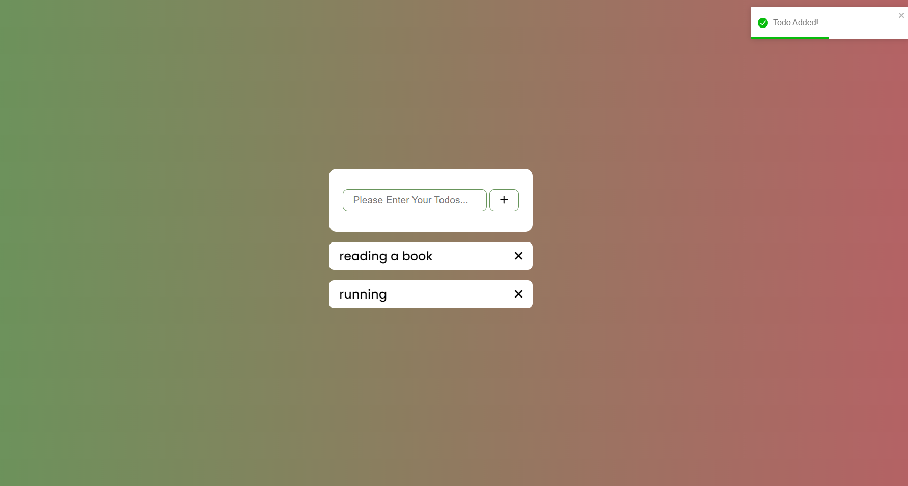

## Welcome! 👋

Thanks to visit my Github! This project is created with React and pure CSS. To give information about toDo's, i used toastify library. Here is the link for this project (https://omer-cicek.github.io/to-do-list-react/)

**To do this project, i used basic React, CSS and Toastify.**

# React Tour Places

## Available Scripts

In the project directory, you can run:

### `npm install`
### `npm start`

## The challenge

Users should be able to:

- View the optimal layout for the site depending on their device's screen size
- Add to do
- Delete to do

## Got feedback for me?

Feedbacks are always improve my technical knowledge, so feel free to give me a feedback through my LinkedIn account (https://www.linkedin.com/in/omercicek97/) 🙌

**This Is What I Did!** 🚀
